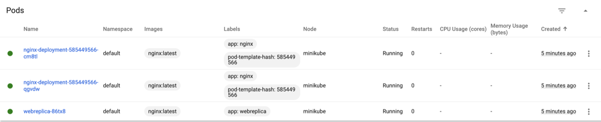

### Dashboard is deployed


### Pod is runned from nginx docker image

Deleating of this pod is irreversible


### Also deployed 2 nginx pods

First of them is ran from file pod.yaml. The deleating of it is irreverseble too. But the second one is deployed from rs.yaml like ReplicaSet. So this unit is scalable and will 'rerun' after deleating.


### As hometask was written deploy.yaml

```bash
apiVersion: apps/v1
kind: Deployment
metadata:
  name: nginx-deployment
  labels:
    app: nginx
spec:
  replicas: 2
  selector:
    matchLabels:
      app: nginx
  template:
    metadata:
      labels:
        app: nginx
    spec:
      containers:
      - name: nginx
        image: nginx:latest
        ports:
        - containerPort: 80
```

After deploy there are two pods added in namespace:


Let's try to delete one of them and check if the other one comes on duty instead of deleted pod:


That's it! New soldier is here! :)

### Let's check one more thing

After deleting of all pods in default ns there should be only 3 kept alive pods. 
Let's check:



Yes, that's right. 2 of pods provides deploy.yaml and last one is provided by rs.yaml!

## Thanks for your lessons!
